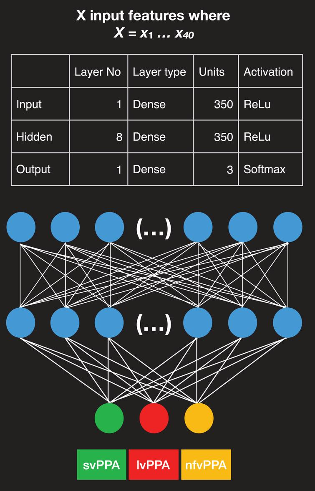

# Introduction

This paper contains code for the 
"Themistocleous, Charalambos et al. ‘Automatic Subtyping of Individuals with Primary Progressive Aphasia’. 1 Jan. 2021 : 1 – 10." paper. 

## Known Issues
The code contained in the repository requires older packages of Python, Tensorflow, and Keras (2018).

## Prerequisites

This project requires scikit-learn, TensorFlow, and Keras, data are analyzed using NumPy, pandas, and visualize with Matplotlib. Most of these packages are included in the Anaconda Environment.

## Note
## The code is written in Tensorflow 1

To Install Anaconda, please visit the official website for instructions.

To install [Keras]

conda install -c keras
Development

## Data Availability

The data contain information about patients' productions that may be employed to identify the patients. Therefore, they cannot be released in this project, based on the Ethics Agreement. Nevertheless, you may use the code using your own data.

# Ethics

Ethic approvals for the study were obtained by the local ethical committee review board (reference number: L091-99, 1999; T479-11, 2011); while the currently described study was approved by the local ethical committee decision 206-16, 2016. For more information see Riksbankens Jubileumsfond – The Swedish Foundation for Humanities and Social Sciences, through the grant agreement no: NHS 14-1761:1.

# Funding
We thank our funding resources for their support: the Science of Learning Institute grant ‘Effects of tDCS in PPA’ from Johns Hopkins University to KT, and NIH/NIDCD R01 DC14475 to KT. We thank Ms. Olivia Hermann for her assistance in this work. 

Conflict of Interest Statement

The authors declare that the research was conducted in the absence of any commercial or financial relationships that could be construed as a potential conflict of interest.

Further work

Future classification work is likely to benefit from machine learning models trained on simultaneous classification of PPA variants using multifactorial predictors from a variety of discourse settings and co-nversations. We will be looking into employing the DNN model to inform rehabilitation. For example, it can enable multiple evaluations of the same patient over time and estimate the stability of symptoms, considering objective assessments of memory and functionality [31]. A modification of the network will make it easier to score the symptoms of the participant by showing the degree of change (positive or negative) due to therapy or due to the progression of the condition. Also, we plan to develop neural network models that distinguish patients with PPA from healthy controls (see for example [16]). A machine learning model trained on healthy controls that can distinguish patients with PPA from individuals with similar sociolinguistic characteristics (e.g., age, education, etc.) without PPA can complement the subtyping process. DNN models open new opportunities in the evaluation and prognosis of PPA and can ultimately enable better treatment solutions.# JAD_paper
